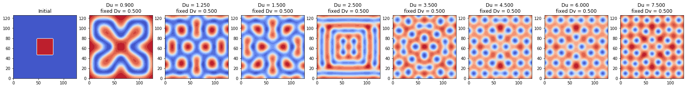
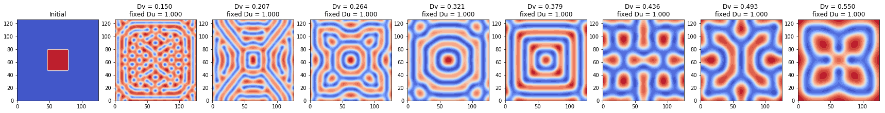
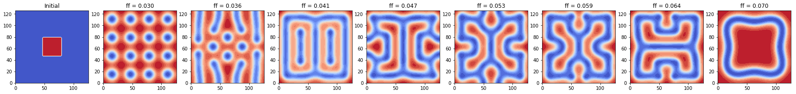
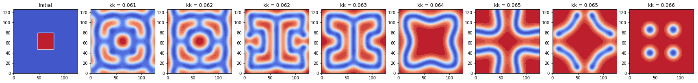

## Contents
{:.no_toc}
*  
{: toc}


By keeping the domain (64 X 64 square), the initial condition (a centered cluster of ones in the activator component matrix U), and all other parameters constant, we searched for the range of one specific parameter at one time that renders a stable ending state pattern. We visualized the **initial condition** and **the ending state patterns for 8 different values in the search range of each parameter** in the model. 

We chose to use ADI method to compute the solution for the PDE equations since it is comparatively the most accurate (2-nd order) and the most stable (allows the largest dt) among all the 4 methods we tried.


## Base Model Parameters Setup

```python
Du = 1.0 # diffusion rate of u
Dv = 0.5 # diffusion rate of v
ff = 0.055 # feed rate, same as 'f' in the model PDE equation
kk = 0.062 # kill rate, same as 'k' in the model PDE equation
```

## Change `Du`, `Dv`


```python
Ny, Nx = 64, 64
h = 2
N = Nx * Ny

Du_arr = [0.9, 1.25, 1.50, 2.50, 3.50, 4.50, 6.00, 7.5]
Dv = 0.5
ff = 0.055
kk = 0.062

dt = 1.5
end_t = 10000
time_steps = int(end_t / dt)
c = dt / (h * h)

U_init = np.zeros((Ny, Nx))
V_init = np.zeros((Ny, Nx))
U_init[:, :] = 1
V_init[24:40, 24:40] = 1

V_ends = np.zeros((len(Du_arr)+1, Ny, Nx))
V_ends[0] = np.copy(V_init)

titles = []
titles.append('Initial')

for idx, Du in enumerate(Du_arr):

    # Construct transform matrices
    D2x = sparse.diags([-2, 1, 1, 1, 1], [0, 1, -1, 1 - Nx, -1 + Nx], shape=(Nx, Nx))
    D2y = sparse.diags([-2, 1, 1, 1, 1], [0, 1, -1, 1 - Ny, -1 + Ny], shape=(Ny, Ny))
    Tu_x = sparse.eye(Nx) - 0.5 * Du * c * D2x
    Tu_y = sparse.eye(Ny) - 0.5 * Du * c * D2y
    Tv_x = sparse.eye(Nx) - 0.5 * Dv * c * D2x
    Tv_y = sparse.eye(Ny) - 0.5 * Dv * c * D2y

    # Factorize matrices
    solve_Tu_x = linalg.factorized(Tu_x.tocsc())
    solve_Tu_y = linalg.factorized(Tu_y.tocsc())
    solve_Tv_x = linalg.factorized(Tv_x.tocsc())
    solve_Tv_y = linalg.factorized(Tv_y.tocsc())

    # Initial condition
    U = np.zeros((time_steps, Ny, Nx))
    V = np.zeros((time_steps, Ny, Nx))
    U[0] = np.copy(U_init)
    V[0] = np.copy(V_init)

    # Generate pattern
    for i in range(1, time_steps):

        # Stage one - solve along x direction
        b1U = 0.5 * Du * c * D2y.dot(U[i - 1]) \
            + (1 - 0.5 * dt * V[i - 1] ** 2 - 0.5 * dt * ff) * U[i - 1] + 0.5 * dt * ff
        b1V = 0.5 * Dv * c * D2y.dot(V[i - 1]) \
            + (1 - 0.5 * dt * kk - 0.5 * dt * ff) * V[i - 1] + 0.5 * dt * U[i - 1] * V[i - 1] ** 2

        U_middle = solve_Tu_x(b1U.T)
        V_middle = solve_Tv_x(b1V.T)

        # Stage two - solve along y direction
        b2U = 0.5 * Du * c * D2x.dot(U_middle) \
            + (1 - 0.5 * dt * V_middle ** 2 - 0.5 * dt * ff) * U_middle + 0.5 * dt * ff
        b2V = 0.5 * Dv * c * D2x.dot(V_middle) \
            + (1 - 0.5 * dt * kk - 0.5 * dt * ff) * V_middle + 0.5 * dt * U_middle * V_middle ** 2

        U[i] = solve_Tu_y(b2U.T)
        V[i] = solve_Tv_y(b2V.T)
        
    V_ends[idx + 1] = U[-1]
    titles.append('Du = %.3f \nfixed Dv = %.3f' % (Du_arr[idx], Dv))

plot_pattern_end_states(V_ends, titles, h)
```





```python
Ny, Nx = 64, 64
h = 2
N = Nx * Ny

Du = 1
Dv_arr = np.linspace(0.15, 0.55, 8)
ff = 0.055
kk = 0.062

dt = 1.5
end_t = 10000
time_steps = int(end_t / dt)
c = dt / (h * h)

U_init = np.zeros((Ny, Nx))
V_init = np.zeros((Ny, Nx))
U_init[:, :] = 1
V_init[24:40, 24:40] = 1

V_ends = np.zeros((len(Dv_arr)+1, Ny, Nx))
V_ends[0] = np.copy(V_init)

titles = []
titles.append('Initial')

for idx, Dv in enumerate(Dv_arr):
    # Initial conditions
    U = np.zeros((time_steps, Ny, Nx))
    V = np.zeros((time_steps, Ny, Nx))
    U[0] = np.copy(U_init)
    V[0] = np.copy(V_init)

    for i in range(1, time_steps):
        # Construct transform matrices
        D2x = sparse.diags([-2, 1, 1, 1, 1], [0, 1, -1, 1 - Nx, -1 + Nx], shape=(Nx, Nx))
        D2y = sparse.diags([-2, 1, 1, 1, 1], [0, 1, -1, 1 - Ny, -1 + Ny], shape=(Ny, Ny))
        Tu_x = sparse.eye(Nx) - 0.5 * Du * c * D2x
        Tu_y = sparse.eye(Ny) - 0.5 * Du * c * D2y
        Tv_x = sparse.eye(Nx) - 0.5 * Dv * c * D2x
        Tv_y = sparse.eye(Ny) - 0.5 * Dv * c * D2y

        # Factorize matrices
        solve_Tu_x = linalg.factorized(Tu_x.tocsc())
        solve_Tu_y = linalg.factorized(Tu_y.tocsc())
        solve_Tv_x = linalg.factorized(Tv_x.tocsc())
        solve_Tv_y = linalg.factorized(Tv_y.tocsc())

        # Stage one - solve along x direction
        b1U = 0.5 * Du * c * D2y.dot(U[i - 1]) \
            + (1 - 0.5 * dt * V[i - 1] ** 2 - 0.5 * dt * ff) * U[i - 1] + 0.5 * dt * ff
        b1V = 0.5 * Dv * c * D2y.dot(V[i - 1]) \
            + (1 - 0.5 * dt * kk - 0.5 * dt * ff) * V[i - 1] + 0.5 * dt * U[i - 1] * V[i - 1] ** 2

        U_middle = solve_Tu_x(b1U.T)
        V_middle = solve_Tv_x(b1V.T)

        # Stage two - solve along y direction
        b2U = 0.5 * Du * c * D2x.dot(U_middle) \
            + (1 - 0.5 * dt * V_middle ** 2 - 0.5 * dt * ff) * U_middle + 0.5 * dt * ff
        b2V = 0.5 * Dv * c * D2x.dot(V_middle) \
            + (1 - 0.5 * dt * kk - 0.5 * dt * ff) * V_middle + 0.5 * dt * U_middle * V_middle ** 2

        U[i] = solve_Tu_y(b2U.T)
        V[i] = solve_Tv_y(b2V.T)
    
    V_ends[idx + 1] = U[-1]
    titles.append('Dv = %.3f \nfixed Du = %.3f' % (Dv_arr[idx], Du))

plot_pattern_end_states(V_ends, titles, h)
```


    dt = 1.5, time_steps = 6666





**Observation**: To get a stable pattern modeled by GS model, we must have Dv << Du (diffusion rate of the activator V must be much smaller than the that of the substrater U):

- when fix Dv = 0.5, Du $\sim$ (0.9, 7.5); 

- when fix Du = 1, Dv $\sim$ (0.15, 0.55).

## Change `ff`


```python
Ny, Nx = 64, 64
h = 2
N = Nx * Ny

Du = 1
Dv = 0.5
ff_arr = np.linspace(0.030, 0.070, 8)
kk = 0.062

dt = 1.5
end_t = 10000
time_steps = int(end_t / dt)
c = dt / (h * h)

D2x = sparse.diags([-2, 1, 1, 1, 1], [0, 1, -1, 1 - Nx, -1 + Nx], shape=(Nx, Nx))
D2y = sparse.diags([-2, 1, 1, 1, 1], [0, 1, -1, 1 - Ny, -1 + Ny], shape=(Ny, Ny))
Tu_x = sparse.eye(Nx) - 0.5 * Du * c * D2x
Tu_y = sparse.eye(Ny) - 0.5 * Du * c * D2y
Tv_x = sparse.eye(Nx) - 0.5 * Dv * c * D2x
Tv_y = sparse.eye(Ny) - 0.5 * Dv * c * D2y

solve_Tu_x = linalg.factorized(Tu_x.tocsc())
solve_Tu_y = linalg.factorized(Tu_y.tocsc())
solve_Tv_x = linalg.factorized(Tv_x.tocsc())
solve_Tv_y = linalg.factorized(Tv_y.tocsc())

U_init = np.zeros((Ny, Nx))
V_init = np.zeros((Ny, Nx))
U_init[:, :] = 1
V_init[24:40, 24:40] = 1

V_ends = np.zeros((len(ff_arr)+1, Ny, Nx))
V_ends[0] = np.copy(V_init)

titles = []
titles.append('Initial')

for idx, ff in enumerate(ff_arr):
    # Initial condition
    U = np.zeros((time_steps, Ny, Nx))
    V = np.zeros((time_steps, Ny, Nx))
    U[0] = np.copy(U_init)
    V[0] = np.copy(V_init)

    # Generate pattern
    for i in range(1, time_steps):
        # Stage one - solve along x direction
        b1U = 0.5 * Du * c * D2y.dot(U[i - 1]) \
            + (1 - 0.5 * dt * V[i - 1] ** 2 - 0.5 * dt * ff) * U[i - 1] + 0.5 * dt * ff
        b1V = 0.5 * Dv * c * D2y.dot(V[i - 1]) \
            + (1 - 0.5 * dt * kk - 0.5 * dt * ff) * V[i - 1] + 0.5 * dt * U[i - 1] * V[i - 1] ** 2

        U_middle = solve_Tu_x(b1U.T)
        V_middle = solve_Tv_x(b1V.T)

        # Stage two - solve along y direction
        b2U = 0.5 * Du * c * D2x.dot(U_middle) \
            + (1 - 0.5 * dt * V_middle ** 2 - 0.5 * dt * ff) * U_middle + 0.5 * dt * ff
        b2V = 0.5 * Dv * c * D2x.dot(V_middle) \
            + (1 - 0.5 * dt * kk - 0.5 * dt * ff) * V_middle + 0.5 * dt * U_middle * V_middle ** 2

        U[i] = solve_Tu_y(b2U.T)
        V[i] = solve_Tv_y(b2V.T)
    
    V_ends[idx + 1] = U[-1]
    titles.append('ff = %.3f' % (ff_arr[idx]))

plot_pattern_end_states(V_ends, titles, h)

```





**Observation**: For stability,

- ff $\sim$ (0.030, 0.070).

## Change `kk`


```python
Ny, Nx = 64, 64
h = 2
N = Nx * Ny

Du = 1
Dv = 0.5
ff = 0.055
kk_arr = np.linspace(0.061, 0.066, 8)

dt = 1.5
end_t = 10000
time_steps = int(end_t / dt)
c = dt / (h * h)

D2x = sparse.diags([-2, 1, 1, 1, 1], [0, 1, -1, 1 - Nx, -1 + Nx], shape=(Nx, Nx))
D2y = sparse.diags([-2, 1, 1, 1, 1], [0, 1, -1, 1 - Ny, -1 + Ny], shape=(Ny, Ny))
Tu_x = sparse.eye(Nx) - 0.5 * Du * c * D2x
Tu_y = sparse.eye(Ny) - 0.5 * Du * c * D2y
Tv_x = sparse.eye(Nx) - 0.5 * Dv * c * D2x
Tv_y = sparse.eye(Ny) - 0.5 * Dv * c * D2y

solve_Tu_x = linalg.factorized(Tu_x.tocsc())
solve_Tu_y = linalg.factorized(Tu_y.tocsc())
solve_Tv_x = linalg.factorized(Tv_x.tocsc())
solve_Tv_y = linalg.factorized(Tv_y.tocsc())

U_init = np.zeros((Ny, Nx))
V_init = np.zeros((Ny, Nx))
U_init[:, :] = 1
V_init[24:40, 24:40] = 1

V_ends = np.zeros((len(kk_arr)+1, Ny, Nx))
V_ends[0] = np.copy(V_init)

titles = []
titles.append('Initial')

for idx, kk in enumerate(kk_arr):
    # Initial condition
    U = np.zeros((time_steps, Ny, Nx))
    V = np.zeros((time_steps, Ny, Nx))
    U[0] = np.copy(U_init)
    V[0] = np.copy(V_init)

    # Generate pattern
    for i in range(1, time_steps):

        # Stage one - solve along x direction
        b1U = 0.5 * Du * c * D2y.dot(U[i - 1]) \
            + (1 - 0.5 * dt * V[i - 1] ** 2 - 0.5 * dt * ff) * U[i - 1] + 0.5 * dt * ff
        b1V = 0.5 * Dv * c * D2y.dot(V[i - 1]) \
            + (1 - 0.5 * dt * kk - 0.5 * dt * ff) * V[i - 1] + 0.5 * dt * U[i - 1] * V[i - 1] ** 2

        U_middle = solve_Tu_x(b1U.T)
        V_middle = solve_Tv_x(b1V.T)

        # Stage two - solve along y direction
        b2U = 0.5 * Du * c * D2x.dot(U_middle) \
            + (1 - 0.5 * dt * V_middle ** 2 - 0.5 * dt * ff) * U_middle + 0.5 * dt * ff
        b2V = 0.5 * Dv * c * D2x.dot(V_middle) \
            + (1 - 0.5 * dt * kk - 0.5 * dt * ff) * V_middle + 0.5 * dt * U_middle * V_middle ** 2

        U[i] = solve_Tu_y(b2U.T)
        V[i] = solve_Tv_y(b2V.T)
    
    V_ends[idx + 1] = U[-1]
    titles.append('kk = %.3f' % (kk_arr[idx]))

plot_pattern_end_states(V_ends, titles, h)
```





**Observation**: For stability, 

- kk $\sim$ (0.061, 0.066).

## Summary
Each parameter in the GS model should stay within its range for generating a stable pattern.  

- Diffusion rates `Du`, `Dv`:
    - when fix Dv = 0.5, Du $\sim$ (0.9, 7.5); 
    - when fix Du = 1, Dv $\sim$ (0.15, 0.55).
    - The diffusion rate of the activator (`Dv`) should be much smaller than the the diffusion rate of the substrate (`Du`). In this way, we maintained the conditions for **short-range autocatalytic process** and the **long-range inhibitory process**.


- Feed rate `ff` and kill rate `kk`:
    - when fixed `kk`=0.062, `ff` $\sim$ (0.030, 0.070)
    - when fixed `ff`=0.055, `kk` $\sim$ (0.061, 0.066)
    - Referring to [Pearson's Parametrization](http://mrob.com/pub/comp/xmorphia/), different combination of specific feed rate and kill rate renders different types of patterns. Based on our experiments with initial condition as a centered cluster of ones in the activator component, we got equally spaced spots, square-like patterns, and symmetric stripes at the 4 corners of the square domain.


```python

```

